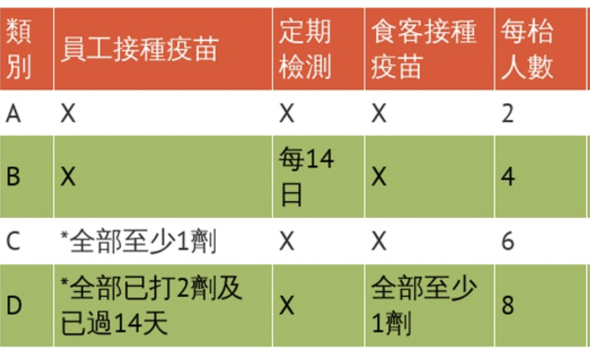

# 0. 前言

這編程教學會以 javascript 語言，去教導編程的基礎概念。

- 我為何要選擇 Javascript 作為教學語言？
  答： 編程世界裡有各式各樣的語言，但其原理也是萬變不離其中。初學者不必執著於該由哪一種語言入手。只要學懂一門語言，將來學另一種語言也會事半功倍。
  並且，javascript 暫時仍是全世界最多人使用的程式語言，並且廣泛地應用在網頁前後端、手機程式開發。 建議初學者學習熱門語言，往後學習更容易尋找到相關的網上教學資源。

* 這教程的內容是編程必學的基礎嗎？
  答： 是的。這教程內容猶如電腦編程的「加減乘除」，是屬於入門技術。 就好比無論你想學習會計、還是學習微積分，其根基都必定是加減乘除。

# 1. 安裝軟件

VSCode
(https://code.visualstudio.com/download)

NodeJS
(https://nodejs.org/en/download/)

# 2. VSCode 基礎操作

- 插件 （extension)
- command box
- terminal box
- `console.log()`使用法
- 給代碼加註譯 `//`

​

# 3. 變數與常數 (variable and constant)

影片教學：
https://www.youtube.com/watch?v=bib3ueAjRQg

在電腦程式裡面，變數是電腦記憶體中可以存放資料的地方，Javascript 會在變數宣告與使用的時候動態配置記憶體。而在變數所存放的內容，則有可能在程式執行時被改變。
若以其值是否可以在程式運作中被改變，可以分為**變數**與**常數**。在程式的運作過程中變數的值可以被改變，而常數的值一經宣告之後就不可以改變。

- 宣告 （declaration)

```javascript
//變數宣告
let a;
var b;
//常數宣告
const A = 1;
```

每個變數只須被宣告一次。

- 未初始化 （initialization)
  變數可以在宣告的時候不賦值（value)。
  但常數則必須在宣告的時候同時賦值。

```javascript
//不帶初始數值。 a 及 b 沒有數值。
let a;
var b;
```

- 賦值 (assign value to variable)

```javascript
//a 及 b 內含數值。
let a = 1;
var b = "hello";
```

- 命名的規則
  - 名字不可以以數字起首
  - 名字不可有空格
  - 名字不可使用`! @ # $ % ^ & * ()`等符號
  - 名字可以有底線 `_`
  - 名字有大細階之分 (case-sensitive)

```javascript
//良好的命名方式
let userId;
var user_id;
var user01;
const PI = 22 / 7;
```

- 保留名字 (reserved words)

# 4. 基本數值型態 （typings)

- 數值 (number)
- 字串 (string)
- 布林 (boolean)
- `null` 和 `underfined`的概念
  ​

```javascript
//number
let weekdays = 7;
const PI = 3.1415;

//string
let name = "Angela";
let greeting = " 8^_^8 你好嗎???";

//boolean
let isValid = true;
let isCorrect = 2 > 3; //false

//undefined
let a;

//null
let b = null;
```

- `console.log()`使用法

```javascript
let weekdays = 7;
console.log(weekdays); //output: 7
console.log("一星期共有", weekdays, "天"); //output: 一星期共有7天
```

# 5. 運算子 Operator

- 數學運算子 （Arithmrtic Operator)

```javascript
let a = 100;
a = a + 10; //a現在是100 + 10 = 110
a = a - 60; //a現在是110 - 60 = 50
a = a * 4; //a現在是50 * 4 = 200
a = a / 5; //a現在是200 / 5  = 40
a = a % 7; //a現在是40 / 7  = 5
```

- 複合指定運算子

```javascript
let a = 1;
a += 3; // 相當於 a = a + 3;
a -= 3; // 相當於 a = a - 3;
a *= 3; // 相當於 a = a * 3;
a /= 3; // 相當於 a = a / 3;
a++; // 相當於 a = a + 1;
a--; // 相當於 a = a - 1;
```

- 數學函數的常用方法

```javascript
a = Math.round(3.1415); // 四捨五入
a = Math.ceil(3.1415); // 向下調整 roundup
a = Math.floor(3.1415); // 向下調整 rounddown
a = Math.abs(-273); // 絕對數值
a = (3.1415).toFixed(2); // 保留兩個小數點
```

其他 javascript 內置數學算式參考：

https://developer.mozilla.org/en-US/docs/Web/JavaScript/Reference/Global_Objects/Math

- 關係運算子 (Relation Operator)

```javascript
3 > 3; // false
3 < 3; // false
3 >= 3; //true
3 <= 3; //true
3 == "3"; //true
3 === "3"; // false
3 != 3; //false
3 !== "3"; //true
```

- 邏輯運算子 (Logical Operator)

  and: `&&` 兩者為 true，結果才會是 true

  or: `||` 兩者為 false，結果才會是 false

  not: `!` true 變 false, false 變 true

```javascript
//例子
3 > 2 && 1 < 2; // true
3 > 2 || 1 > 2; //true
!true; //false
```

- 運算子先後次序
  1. 括號內`( )` 最優先處理
  2. 先乘除，後加減
  3. 關係運算子
  4. 邏輯運算子

```javascript
//例子
3 + 4 * 0; // 3
(3 + 4) * 0; // 0
3 < 2 || 1 > 2 || 3 + 1 > 2; // true
```

# 5. if ... else 條件指令

當程式流程在進行時，需要根據某個條件來決定是否執行接下來的動作時，就需要用到 `if ... else` 敘述。

影片教學:
https://www.youtube.com/watch?v=_2BFEHB-PSA

- `if...`
- `if...else...`
- `if...else...if...`

```javascript
//if 例子

let isSunnyDay = true;

if (isSunnyDay) {
  console.log("外出");
}
//結果： 外出
```

```javascript
//if ... else 例子

let isSunnyDay = false;

if (isSunnyDay) {
  console.log("外出");
} else {
  console.log("留在室內");
}
//結果： 留在室內
```

```javascript
//if ... else ... if 例子

let isSunnyDay = false;
let hasMoney = false;

if (isSunnyDay){
  console.log("行山")
} else if (hasMoney){
  console.log("行街銷費")
} else {
  console.log("圖書館看書")
//結果： 圖書館看書
```

- 配合運算子使用條件指令

```javascript
let num = 5;
if (num % 2 == 0) {
  console.log(num, "是雙數");
} else {
  console.log(num, "是單數");
}
```

- - 例題 1：

    判斷數字是雙數或單數。

- - 例題 2：

    判斷歲數的年齡層：

    1. 0-2 歲：嬰兒
    2. 3-10 歲：兒童
    3. 11-20 歲：少年
    4. 21-40 歲： 青年
    5. 41-64 歲： 中年
    6. 65 歲或以上： 長者

- - 例題 3：

    計算年份是否為閏年。條件：

    1. 公元年非 4 的倍數，為平年。
    2. 公元年為 4 的倍數但非 100 的倍數，為閏年。
    3. 公元年為 100 的倍數但非 400 的倍數，為平年。
    4. 公元年為 400 的倍數為閏年。
    5.

    （測試年份： 1984、1988、1992、1996、2000、2004、2008、2012、2016 為閏年）

- - 例題 4：

    計算可獲得的折購金額：

    1. 會員消費有 9 折
    2. 會員消費滿\$500 元可享有額外 85 折
    3. 非會員消費滿\$500 元有 9 折

- - 例題 5：
    將輸入的分鐘，變成「小時、分鐘」的格式。

```javascript
var minutes = 130;
//預期結果： 2小時10分鐘
```

- - 例題 6：
    判斷 3 個變數的數字，是否順序排列。

```javascript
//例子一 ：
var a = 1;
var b = 2;
var c = 5;
//預期結果 ： 小至大順序

//例子二 ：
var a = 50;
var b = 21;
var c = 0;
//預期結果 ： 大至小順序

//例子三 ：
var a = 6;
var b = 10;
var c = 2;
//預期結果 ： 不順序

//例子四 ：
var a = 88;
var b = 88;
var c = 88;
//預期結果 ： 三個數字相同
```

`if...else`在每一次判斷只限於兩樣事物之間二選一。如果需要在多樣事物之間選一，可以考慮使用`switch...case`。

```javascript
//switch...case 例子
var trafficLight = "dark";

switch (trafficLight) {
  case "red":
    console.log("紅燈，要停車");
    break;
  case "yellow":
    console.log("黃燈，準備開車");
    break;
  case "green":
    console.log("綠燈，可以行車");
    break;
  default:
    console.log("不是交通燈顏色！");
    break;
}
```

# 6. 迴圈 Looping

在處理資料的時候，時常會需要重複執行某些相同的步驟；而迴圈 (loop) 的作用是讓指定的某段敘述在條件符合的情況下一直重覆執行，是程式設計中很重要的一種控制結構。我們可以利用迴圈來進行重覆性的資料輸入、處理與輸出。

- for loop: `for...`
- while loop: `while...`
- do-while loop: `do...while`

```javascript
//for loop 例子

for (let i = 0; i < 10; i++) {
  console.log(i);
}
//結果： 0123456789
```

- 巢狀迴圈 nested for-loop

  巢狀迴圈的特性是在迴圈裡面又包覆著其他的迴圈。
  從外層迴圈來看，內層迴圈只是外層迴圈內所要執行的一段程式敘述而已；因此外層迴圈每動作一次，內層迴圈就會把整個迴圈執行一遍，執行完畢後才跳回到外層迴圈準備下一次的動作。

```javascript
//nested for loop 例子
//製作乘數表

for (let i = 1; i < 10; i++) {
  for (let j = 1; j < 10; j++) {
    console.log(i, "*", j, "=", i * j);
  }
}
//現實編程裡，nested for loop 一般最多用到2層
//若果要用到3層,就不是一個好的程式設計
```

- - 例題 6.1：

    找出所有 100 以內的質數。
    質數（Prime number）指在大於 1 的自然數中，除了 1 和該數自身外，無法被其他自然數整除的數。
    （答案： 2, 3, 5, 7, 11, 13, 17, 19, 23, 29, 31, 37, 41, 43, 47, 53, 59, 61, 67, 71, 73, 79, 83, 89, 97）

- - 例題 6.2：

    試用 nested loop 寫出以下數字
    1
    12
    123
    1234
    12345
    123456
    ...

- - 例題 6.3：

  運算變數的階乘。

```javascript
var factorial = 5;
//結果： 5*4*3*2*1 ＝ 120
```

- while loop 例子：-

```javascript
let i = 9;
while (i >= 0) {
  console.log(i);
  i--;
}
//結果： 9876543210
```

- do while 例子：-

```javascript
let i = 9;
do {
  console.log(i);
  i--;
} while (i >= 0);

//結果： 9876543210
```

# 7. 陣列 Array

陣列是指一串的資料。
如果我們視「變數」是一格櫃桶，那麼陣列就是一排的櫃桶。

```javascript
let a = []; //空陣列
let b = [10, 20, 30, 40, 50]; //只儲存數字的陣列
let d = [1, 2, [3, 4, 5], 6]; //陣列中的陣列

//index 陣列的索引
console.log(b[0]); //10
console.log(b[4]); //50

//陣列的長度
console.log(b.length); //5
```

- 一般而言，一個陣列中，只會放置同類型的資料。
- 陣列 配合 for loop 的使用 的例子 1：

```javascript
let userName = ["陳大文", "王小明", "Chris Wong"];
for (i = 0; i < userName.length; i++) {
  console.log(userName[i]);
}
//結果： 陳大文 王小明 Chris Wong
```

- 陣列 配合 for loop 的使用 的例子 2：

```javascript
//運算數列裡的平方數
let b = [1, 2, 3, 4, 5];
for (i = 0; i < b.length; i++) {
  console.log(b[i] * b[i]);
}
//結果： 1 4 9 16 25
```

- 陣列的常用方法和功能
  https://twitter.com/profulsadangi/status/1288053880010334208


- 陣列 配合 map 的使用 的例子：
```javascript
//運算數列裡的平方數
let b = [1, 2, 3, 4, 5];
let c = b.map((x) => x * x);
console.log(c);
//結果： 1 4 9 16 25
```

```javascript
let testing = ["a", "b", "c"];

// 顯示第1個元素（element)
console.log(testing[0]); //"a"
// 顯示元素的數量
console.log(testing.length); //3
//增加元素
testing.push("d"); //["a", "b", "c", "d"]
```

- - 例題 7.1：

試將兩組陣列相對應的值相加。

```javascript
//例子1 ：
var arr_1 = [1, 0, 2, 3, 4];
var arr_2 = [3, 5, 6, 7, 8];
//預期結果 ： [4, 5, 8, 10, 12]

//例子2 ：
var arr_1 = [];
var arr_2 = [3, 5, 6, 7, 8];
//預期結果 ： [4, 5, 6, 7, 8]

//例子3 ：
var arr_1 = [];
var arr_2 = [];
//預期結果 ： []

//例子4 ：
var arr_1 = [1, 0, 2];
var arr_2 = [3, 5, 1, 7, 4];
//預期結果 ： [4, 5, 3, 7, 4]
```

- - 例題 7.2：

試找出陣列中最大的值。

```javascript
//例子 ：
var arr = [5, 7, -6, 0, -1];
//預期結果 ： 7
```

# 8. 函式 Function

「函式」指的是將一或多段程式指令包裝起來，可以重複使用，也方便維護。
函式只會在被呼叫的時候才執行，函式本身並不會主動執行。


- 函式基本寫法
  - 函式語法結構:-
  
  - 呼叫函式:-
  
```javascript
function number() {
  //定義函式內容
  console.log("我是一個function");
}

number(); //呼叫number函式
number(); //呼叫number函式
//函式可被無限次呼叫
```

- 函式帶入參數 (parameters)

```javascript
function addition(num1, num2) {
  var total = num1 + num2;
  console.log("總和是" + total);
}
addition(1, 2); //總和是3
addition(3, 3); //總和是6

```
- 區域變數 (Local variable)：當變數在一個函數內宣告，就只能在該函式中使用；全域變數 (Global variable)：當變數在函數範圍之外宣告，就能在程式各處使用
- - 例題 8.1：

試設計一個可以計算圓周的函式。

```javascript
//例子 ：
var r = 3;
findCircumstance(r);
//預期結果 ： 18.84
```


- - 例題 8.2：

試設計一個可以運算出陣列裡最小數值的函式。

```javascript
//例子 ：
var arr = [-5, 7, -6, 0, -1]
findMin(arr);
//預期結果 ： -6
```
- - 例題 8.3：

試設計一個可以判斷餐廳級別的函式。
  
  - 輸入參數:
    1. 員工接種疫苗情況
    2. 食客接種疫苗情況
  - 輸出結果：
    1. 餐廳所屬級別
    2. 每枱可容納的人數
```javascript
//例子 ：
var staff_vaccine : 2;
var customer_vaccine: 1;
findRestaurantGrade(staff_vaccine, customer_vaccine);
//預期結果 ： 屬於D區，可容納最多8人。
```
- 有回傳（return）的函式

回傳（return）的意義
函式可以透過 return 回傳函式運算完的結果，回傳的值可在函式外透過宣告變數來儲存。
例如，於上面的例題 8.1，該函式的功能是計算圓周，所以，我們會預期把函式裡計算得出的答案，回傳給一個變數。（也就是說，利用一個變數，去儲存這個答案），寫法如下：

```javascript

findCircumstance(r){
  return (2 *  Math.PI * r)
}

var answer = findCircumstance(3);
console.log(answer);
//answer會儲起函式回傳的數值
```

若函式不回傳值，則可省略 return。但要注意，當 return 執行時，解譯器會跳出該函式，所以如果 return 後面還有程式碼，則不會被執行。因此，用 return 回傳空值也具有「中止」程式碼的功能。
所以，一般情況下，return應該會寫在函式內的最後一行。

- - 例題 8.4：

試設計一個可以回傳平方數的函式。
```javascript

var a = square(4);
// a = 16;
var a = square(10);
//a = 100;
```